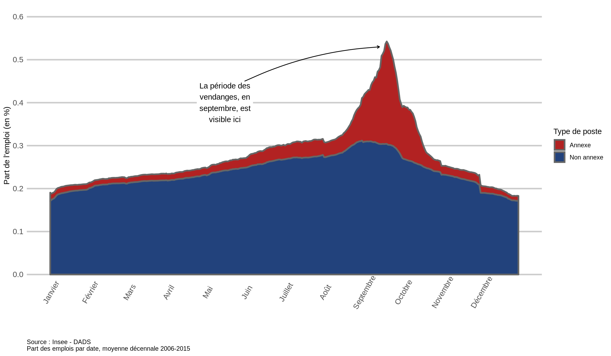
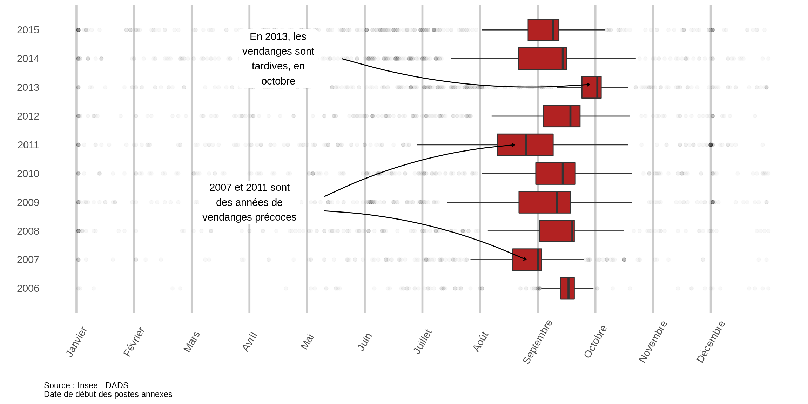
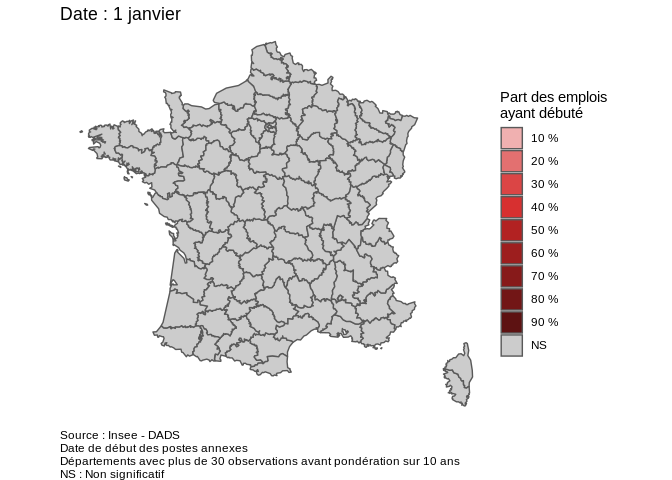
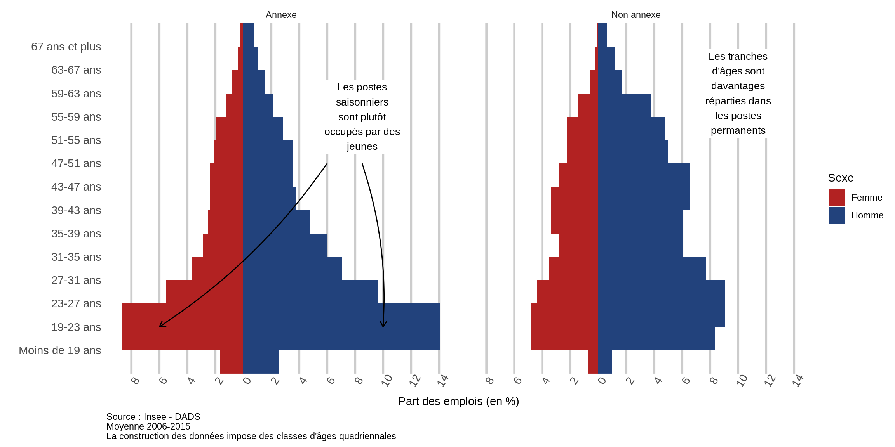

Tisser un peu le récit (référence littéraire ? style journalistique ?)

Intro sur qui compose la PCS au niveau métier, combien d'emploi (postes) cela représente + renvoi à la note méthodologique de fin.

691D : Ouvriers de la viticulture ou de l'arboriculture fruitière

## Emplois permanents et saisonniers

Au sein de la profession des ouvriers viticoles et arboriculteurs, deux modalités d'emploi se dessinent :

+ d'un côté des emplois permanents (ou poste non-annexe), à l'année ou sur des périodes longues. En moyenne, sur 10 ans, ils représentent 41 % des emplois et 86 % des jours travaillés ;
+ de l'autre côté des emplois saisonniers (ou poste annexe), sur de courtes périodes, pour les récoltes. De façon, inverse, ils représentent la majorité des emplois, 59 %, mais seulement 14 % des jours travaillés.

## Analyse de la saisonnalité

De façon assez logique, ces emplois ne se répartissent pas de la même façon au cours de l'année. Les emplois permanents sont de faits relativement stables selon les périodes, bien qu'on observe un pic au moment des récoltes. Les emplois saisonniers se multiplient au moment des périodes de récolte et notamment pendant les vendanges.

Pour les postes annexes, la saisonnalité est fortement marquée. On peut toutefois observer des différences selon les années, avec des récoltes plus ou moins tardives, fonction notamment des conditions météorologiques à l'hiver, au printemps et durant tout l'été. Ces phénomènes se répercutent alors sur l'emploi.

## Analyse géographique

Selon les départements, les récoltes et en particulier les vendanges, ne débutent pas à la même date.

Cas Champagne, Gironde, Alasace, Occitanie, etc...

## Analyse démographique

On a des profils différents selon qu'il s'agisse des postes annexes ou non annexes.

> ## Méthodologie
>
> La déclaration annuelle de données sociales (DADS) est une formalité administrative obligatoire pour toute entreprise employant des salariés. Elle contient des informations relatives à l'établissement et au salarié.
> Ces données sont recueillies par l'Insee qui constitue des fichiers d'analyse. Le fichier utilisé ici est le fichier "postes" où chaque enregistrement correspond à un poste, c'est-à-dire à la consolidation des périodes de travail d'un salarié dans un même établissement.
>
> Un poste est catégorisé en fonction de plusieurs critères pour analyser si il relève d'un "vrai" emploi ou d'un poste non annexe, par exemple saisonnier ou de très courte durée. Un poste est dit non-annexe si :
>
> + la rémunération nette est supérieure à 3 SMIC mensuels ;
> + ou le nombre d'heures salariées est supérieur à 120 et la durée de travail supérieure à 30 jours.
>
> Dans les autres cas, le poste est considéré comme annexe.
>
> ## Code et analyse
>
> L'ensemble de l'analyse et du code est disponible sur [github](https://github.com/tvroylandt/vendanges).
>
> Les remarques, commentaires et propositions sont les bienvenus : tvroylandt@gmail.com
>

